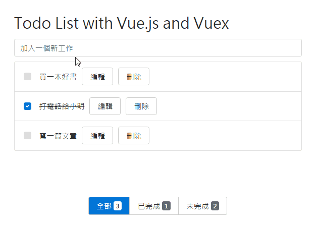
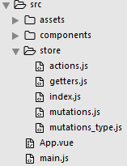

# Todo List with Vue.js and Vuex
利用 Vue.js 與 Vuex 實作一個 Todo List。

([網誌版](https://cythilya.github.io/2017/03/25/todo-list-with-vue-and-vuex/))

## 功能介紹
實作的功能有

- 新增 todo
- 修改 todo 的內容
- 變更 todo 的狀態：已完成或未完成
- 刪除 todo
- 切換檢視模式：看全部、已完成或未完成的 todo
- 在檢視按鈕上顯示目前全部、已完成和未完成的 todo 數量

## Demo


## 說明
主要使用 Vue、Vuex 和 [Bootstrap Vue](https://bootstrap-vue.github.io/docs)。

### 程式流程
1. 使用者與畫面互動，發送 dispatch 至 action
2. 藉由 action 發送 commit 至 mutation
3. 在 mutation 改變 state
4. 更新畫面

### 檔案結構


主要分為

- assets：放靜態檔案的地方，例如：樣式(scss/css)、圖檔
- components：元件，畫面要顯示部份會放在這裡，例如：HTML、(Scoped) CSS、和一些 JS。將從 getter 取得的資料帶到畫面，或將使用者輸入的資料對應至 action 或由此發出 dispatch 至 action。
- getter.js：取得 view 所需的資料，例如：todo list、目前全部、已完成和未完成的 todo 數量。
- actions.js：要執行的動作，接受使用者與畫面的互動所產生的資料，發送 commit 至 mutation 以做後續處理。
- mutations.js：(1) 放至 state 初始值；(2) 處理由 action 傳過來的資料來更新 state。
- mutations_type.js：將動作定義成常數的地方，方便其他檔案直接引入，這對大型專案來說是方便的作法，也能一目了然專案的狀況。

## 遇到的問題 / 解法
### 在`<input>`上綁定`v-model`，導致在 mutation 以外的地方改變 state
解法：使用 event handler 或 watch。

在更新 todo 的文字時，過去都是利用`v-model`雙向綁定的特性來改變資料，但在此使用 vuex 統一管理狀態，因此只能經由 action 發送 commit，交由 mutation 來改變資料。

當使用者編輯 todo 文字，按下 enter 鍵結束編輯後，將 todo 的 ID 和使用者輸入的字串包成一個 object，由 method 發送 dispatch (components/TodoList.vue)給 action。

```javascript
updateTodo: function(index, content) {
  this.$store.dispatch('updateTodo', {
    index: index,
    content: content
  })
}
```

由 action 發送 commit (actions.js) 至 mutation，其中將得到的資料包成 payload 也一起送過去。

```javascript
export const updateTodo = ({ commit }, payload) => {
  commit(types.UPDATETODO, payload);
}
```

由 mutation 更新 state (mutations.js)

```javascript
[types.UPDATETODO](state, payload) {
  state.todos[payload.index].text = payload.content;
}
```

備註：在這裡`$event.target.value`無法直接傳送資料到 action，必須在 view 使用 `$store.dispatch`，並將資料由 payload 帶給 action 和 mutation。

### 什麼是 Scoped CSS？
當`<style>`標籤有 scoped 屬性時，樣式就只能作用於當前的元件。在同一個元件內，可以同時有作用域和無作用域的樣式。

### 如何引入外部樣式檔案？
解法

- 使用import，例如：`@import "../assets/css/style.scss";`
- 在`<style>`加上source，例如：`<style src="../assets/css/style.scss"></style>`

---

## 參考資料 / 推薦閱讀
- [Vuex(英)](https://vuex.vuejs.org/en/)
- [Vuex(簡中)](https://vuex.vuejs.org/zh-cn/)
- [第一次用 Vue.js 就愛上 [改]](https://www.slideshare.net/kurotanshi/vuejs-62131923)
- [Vue js 大型專案架構](https://www.slideshare.net/hinablue/vue-js)
- [實作小範例入門 Vue & Vuex 2.0系列](http://ithelp.ithome.com.tw/users/20103326/ironman/1114)
- [Vue.js 30天](http://ithelp.ithome.com.tw/users/20103424/ironman/1049)
- [Bootstrap Vue](https://bootstrap-vue.github.io/docs)
